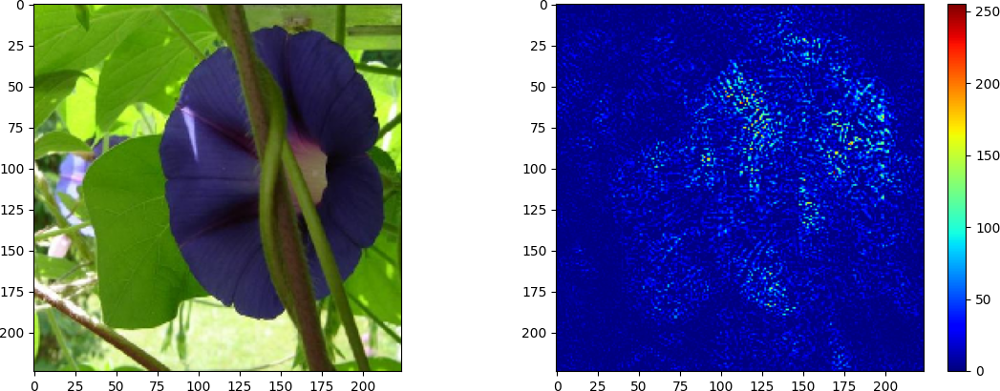

# Classification of flower images starting from a small dataset


## Installation
Python3 is required alogn with cudnna and CUDA Toolkit.

Use the package manager [pip](https://pip.pypa.io/en/stable/) to install the required dependencies.

```bash
pip install -r requirements.txt
```

Download the dataset from https://www.robots.ox.ac.uk/~vgg/data/flowers/102/

Create a folder called `data` and move the downloaded archive. Then execute

```bash
matlab -nodisplay -nosplash -nodesktop -r "run('split_dataset_paper.m');exit;"
```

in the same folder.

## Usage

### Training
```bash
trainer.py [-h] [--batch [BATCH]] [--arch [ARCHITECTURE]] [--opt [OPTIMIZER]] [--clr [CLR]] [--step [STEP]] [--dropout [DROPOUT]] [--config [CONFIG]] [--mp] [--da] [--epoch [EPOCH]]

```
```
optional arguments:
  -h, --help            show this help message and exit
  --batch [BATCH]       Batch size used during training
  --arch [{efficientnetb4,frozenefficientnetb4,inceptionv3,resnet18}]
                        Architecture
  --opt [{Adam,SGD}]    Optimizer
  --clr [{triangular,triangular2,exp}]
                        Cyclical learning rate
  --step [STEP]         Step size
  --dropout [DROPOUT]   Dropout rate (when used with FrozenEfficientNetB4 it's used for the freeze rate)
  --config [CONFIG]     Configuration file
  --mp                  Enable mixed precision operations (16bit-32bit)
  --da                  Enable Data Augmentation
  --epoch [EPOCH]       Set the number of epochs
```

The script will produce plots and checkpoints in `./output/plots` and `./output/checkpoints`

### Learning Rate Finder
```bash
python learningratefinder.py [-h] [--batch [BATCH]] [--arch [ARCHITECTURE]] [--opt [OPTIMIZER]] [--dropout [DROPOUT]] [--config [CONFIG]] [--da] [--freeze [FREEZE]] [--epoch [EPOCH]]
```
```
optional arguments:
  -h, --help            show this help message and exit
  --batch [BATCH]       Batch size used during training
  --arch [{efficientnetb4,frozenefficientnetb4,inceptionv3,resnet18}]
                        Architecture
  --opt [{Adam,SGD}]    Optimizer
  --dropout [DROPOUT]   Dropout rate
  --config [CONFIG]     Configuration file
  --da                  Enable Data Augmentation
  --freeze [FREEZE]     Frozen layers
  --epoch [EPOCH]       Set the number of epochs
```
## Visualization

To visualize Saliency Map and Grad-CAM run 
```bash
python3 visualize.py
```

The image must be store with the following pattern `./images/{class}/{image}.jpg`

## Contributing

The repository is hosted in Github https://github.com/firaja/aml

## License

[MIT](https://choosealicense.com/licenses/mit/)
